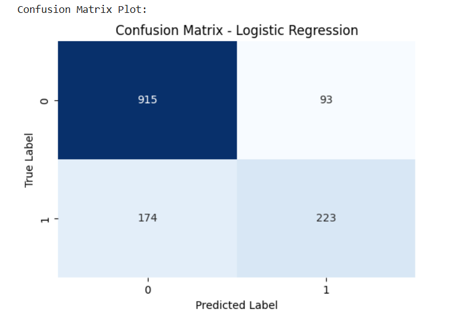

# Telecom Customer Churn Prediction System

## 1. Project Overview

This project is an end-to-end Machine Learning web application developed for the Skyrec Academy AI & ML Capstone Project.

The system predicts whether a telecommunications customer is likely to churn based on customer account details and service usage patterns.

The project simulates a Sri Lankan telecommunication business environment using the publicly available IBM Telco Customer Churn Dataset.

---

## 2. Problem Statement

Customer churn is a major challenge in the telecommunications industry. In highly competitive markets such as Sri Lanka, customers frequently switch service providers due to pricing, network quality, and service experience.

The objective of this project is to build a Machine Learning-powered web application that predicts customer churn, helping telecom providers identify high-risk customers and improve customer retention strategies.

---

## 3. Dataset

Dataset Source:
IBM Telco Customer Churn Dataset

Dataset Link:
https://www.kaggle.com/datasets/yeanzc/telco-customer-churn-ibm-dataset

Note:
Since publicly accessible Sri Lankan telecom datasets are not available due to privacy constraints, this dataset was used to simulate a Sri Lankan telecom environment.

---

## 4. Technologies Used

### Machine Learning Pipeline
- Python
- Pandas
- NumPy
- Scikit-learn
- Matplotlib
- Seaborn

### Backend
- Flask
- Flask-CORS

### Frontend
- HTML
- CSS
- JavaScript

### Model Deployment
- Joblib

---

## 5. Machine Learning Workflow

The following steps were implemented in the ML pipeline:

1. Data Ingestion
2. Data Cleaning and Preprocessing
3. Feature Engineering
4. Feature Encoding
5. Train-Test Split
6. Model Training
7. Model Evaluation
8. Model Serialization

---

## 6. Models Used

The following Machine Learning models were trained and evaluated:

- Logistic Regression
- Decision Tree Classifier
- Random Forest Classifier

### Final Model Selection

| Model | Accuracy |
|------|------|
| Logistic Regression | 81.00% |
| Decision Tree | 73.31% |
| Random Forest | 79.86% |

Best Model Selected:
**Logistic Regression**

---

## 7. Model Evaluation

The final Logistic Regression model achieved an overall accuracy of 81%.

Evaluation techniques used:
- Accuracy Score
- Precision
- Recall
- F1-Score
- Confusion Matrix

The model demonstrated balanced performance in identifying both churn and non-churn customers.

---

## 8. Project Structure

```text
telecom-churn-capstone/
│
├── backend/
│   ├── app.py
│   ├── churn_prediction_model.pkl
│   ├── model_columns.pkl
│   └── scaler.pkl
│
├── frontend/
│   └── index.html
│
├── ml_pipeline/
│   ├── Final_Project_Skyrec.ipynb
│   └── final_project_skyrec.py
│
├── screenshots/
│   ├── confusion_matrix.png
│   ├── frontend_before_prediction.png
│   ├── frontend_after_prediction_1.png
│   ├── frontend_after_prediction_2.png
│   └── model_accuracy.png
│
├── documents/
│   ├── Project_proposal.pdf
│   └── Project_Report.pdf
│
├── README.md
├── requirements.txt
├── LICENSE
└── .gitignore
```

---

## 9. How to Run the Project

### Step 1 — Clone Repository

```bash
git clone https://github.com/YOUR_USERNAME/telecom-churn-capstone.git
```

---

### Step 2 — Navigate to Backend Folder

```bash
cd telecom-churn-capstone/backend
```

---

### Step 3 — Install Required Packages

```bash
pip install -r ../requirements.txt
```

---

### Step 4 — Run Flask Backend

```bash
python app.py
```

Backend will start on:

```text
http://127.0.0.1:5000
```

---

### Step 5 — Open Frontend

Open:

```text
frontend/index.html
```

in your web browser.

---

## 10. Application Features

- Predict telecom customer churn
- Interactive frontend interface
- Real-time prediction results
- REST API integration using Flask
- Machine Learning model deployment

---

## 11. System Screenshots

### Frontend UI Before Prediction


---

### Frontend UI After Successful Prediction - 01


---

### Frontend UI After Successful Prediction - 02


---

### Confusion Matrix



---

### Model Accuracy


---

## 12. Author

**P.G.R. Hasith Pusswella**  
AI & ML Capstone Project  
Skyrec Academy

---

## 13. License

This project is licensed under the MIT License.
